# Amazon Web Services (AWS) <!-- omit in toc -->

- [Semana 1. Introducción](#semana-1-introducción)
  - [¿Qué es la informática de la nube?](#qué-es-la-informática-de-la-nube)
  - [Ventajas de la nube](#ventajas-de-la-nube)
  - [Tipos de implementación de cómputo en la nube](#tipos-de-implementación-de-cómputo-en-la-nube)
  - [Modelos de servicios](#modelos-de-servicios)
  - [Infraestructura global](#infraestructura-global)
  - [Evolución](#evolución)
    - [Historia](#historia)
    - [El futuro](#el-futuro)
- [Semana 1. A lo concreto](#semana-1-a-lo-concreto)
  - [¿Qué se necesita  para tener un Data Center?](#qué-se-necesita--para-tener-un-data-center)
  - [Capex vs Opex](#capex-vs-opex)
- [Videos](#videos)
- [Semana 2. Clase 1](#semana-2-clase-1)

## Semana 1. Introducción

### ¿Qué es la informática de la nube?

También es llamada computación en la nube (cloud computing) o simplemente nube.

**Definición de los grandes**

Estas son las definiciones que dan algunas entidades importantes:

- Amazon:
    La informática en la nube es la distribución de recursos de TI bajo demanda (on-demand) a través de Internet mediante un esquema de pago por uso. En lugar de comprar, poseer y mantener servidores y centros de datos físicos, puedes acceder a servicios tecnológicos, como capacidad informática, almacenamiento y bases de datos, en función de tus necesidades a través de un proveedor de la nube como AWS.

- Salesforce:
    La informática en la nube es la prestación de servicios informáticos, tales como software, bases de datos, servidores y conexiones a red, a través de Internet. Esto significa que los usuarios finales pueden acceder a software y aplicaciones desde cualuier punto donde se encuentren.
    El alojamiento de los programas informáticos lo lleva a cabo un tercero, y estos residen en "la nube". Esto significa que los usuarios no se tienen que preocupar por cosas como el almacenamiento y la capacidad, solo tienen que disfrutar del resultado final.

- Microsoft:
    Dicho de manera sencilla, la informática en la nube es el suministro de servicios informáticos (incluyendo servidores, almacenamiento, bases de datos, redes, software, análisis e inteligencia) a través de Internet ("la nube"), cuyo objetivo es ofrecer una innovación más rápida, recursos flexibles y economías de escala. Lo habitual es pagar solo por los servicios en la nube utilizados, a fin de reducir los costes operativos, ejecutar la infraestructura con más eficacia y escalar a medida que cambian las necesidades de tu negocio.

- Google
    Conocer los tipos de recursos de cloud computing puede requerir mucho tiempo y dinero. Las empresas necesitan comprar servidores físicos y otra infraestructura por medio de procesos de aprovisionamiento que pueden durar meses... Los sistemas adquiridos requieren espacio físico, por lo general, una sala especializada que ofrezca suficiente potencia y refrigeración [Data Center]. Después de configurar y desplegar los sistemas, las empresas necesitan expertos que los gestionen.

    Escalar este proceso de larga duración cuando hay picos de demanda o mientras que el negocio crece es complicado. Las empresas pueden adquirir más recursos de computación de los que necesitan y acabar con un bajo nivel de utilización.

    El cloud computing soluciona estos problemas ofreciendo recursos de computación como servicios escalables y bajo demanda (on-demand).

- IBM:
    La computación en la nube es el acceso bajo demanda (on-demand), a través de Internet, a recursos informáticos (aplicaciones, servifores físicos y virtuales, almacenamiento de datos, herramientas de desarrollo, capacidadesde red, etc.) alojados en un centro de datos remoto gestionado por un proveedor de servicios en la nube (o CSP). El CSP pone a disposición estos recursos por una cuota de suscripción mensual o los factura en función del uso.

- Red Hat:
    La computación en la nube es el acto de ejecutar cargas de trabajo dentro de nubes, que son entornos informáticos que abstraen, agrupan y comparten recursos escalabes a través de una red. Ni la computación en nube ni las nubes son tecnologías en sí mismas.

    La computación en la nube es un acto: ejecutar cargas de trabajo en la nube.

    Las nubes son entornos, lugares en donde se ejecutan las aplicaciones. Las tecnologías son cosas: software y hardware utilizados para constuir y utilizar nubes.

**Nuestra definición**

Entonces, para nosotros la informática en la nube es:

    - usar servicios informáticos bajo demanda, dados por un CSP a través de Internet, 
    - para ejecutar cargas de trabajo 
    - sin adquirir la infraestructura física necesaria para ejectuar estas cargas (la nube se encarga).

Servicios informáticos, recursos de TI y recursos de computación son sinónimos de lo mismo (lo que da un provedor de servicios en la nube o CSP, por Cloud Solutions Provider).

Los servicios son bajo demanda (on-demand). La computación bajo demanda (ODC, por "On-Demand Computation") es un modelo de entrega a nivel empresarial que permite a los usuarios 

- aprovisionar y desaprovisionar fácilmente recursos en la nube cuando los necesitan. Solo usas lo que necesitas cuando lo necesitas.

Estos servicios pueden ser 
- software, servidores, bases de datos, redes, entornos de desarrollo, análisis e inteligencia, etc.

Pagas por el uso (pay-as-you-go), por lo que es una solución que evita los costos iniciales altos y escala con las necesidades del cliente.

### Ventajas de la nube

Se nos explican 6 ventajas principales:

1. Cambias costos de capital por costos variables

    No tienes que gastar en costosos servidores, firewalls, UPS y demás equipos solo para darte cuenta de que quizás la aplicación no era muy buena idea. Con la nube pagas solo por los recursos que usas, y solo en la medida en que los usas.

2. Te beneficias de la economía de escala
    
    Un proveedor de servicios en la nube como AWS ha optimizado sus instalaciones y sus gastos para ofrecer de forma competitiva recursos TI a millones de usuarios y empresas de todo el mundo. Por eso los costos variables que piden son bajos.

3. Dejas de precuparte por planificar la capacidad

    No tienes que anticipar cuánta capacidad de cómputo o de almacenamiento necesitas para tu aplicación. Con solo unos clics puedes aprovisionar o desaprovisionar los recursos que necesitas cuando los necesitas. Es un gran ahorro de tiempo y una preocupación menos.

4. Aumentas la agilidad y flexibilidad

    Los desarrolladores pueden hacer pruebas y comenzar a desarrollar más rápido gracias a la facilidad de uso de los servicios de AWS.

5. Dejas de gastar dinero en un centro de datos

    La informática en la nube te permite centrarte en tu propuesta de valor en vez de en el arduo trabajo indiferenciado de la infraestructura. 
    
    El trabajo indiferenciado (undifferentiated heavy lifting) es lo que toda aplicación necesita para funcionar, pero que no agrega valor. Por eso AWS lo hace por ti.

6. Tu alcance es global en minutos

    Gracias a la infraestructura global de AWS, en unos mintuos puedes implementar tu aplicación en una región cercana a tus clientes para disminuir el tiempo de latencia y así aumentar la performance de tu aplicación.

### Tipos de implementación de cómputo en la nube

**Nube**

**On-premises**

La palabra _premises_ significa 'instalaciones'. Se trata de la temida e infame implementación de un centro de datos completo para soportar nuestra aplicación, con todas las complicaciones y gastos de tiempo y dinero que ello supone.

**Híbrido**

### Modelos de servicios

Los modelos de servicios se corresponden con el nivel de control y flexibilidad que tienes sobre los recursos TI.

**IaaS**

Ofrece el mayor nivel de control sobre los recursos informáticos, como conexión de red, máquinas virtuales y espacio de almacenamiento de datos. Contiene los bloques fundamentales para crear aplicaciones.

**PaaS**

**SaaS**

### Infraestructura global

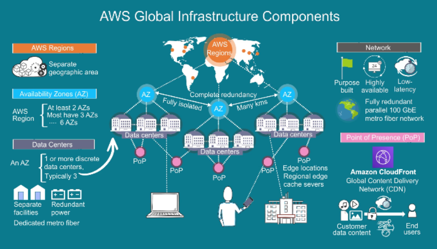

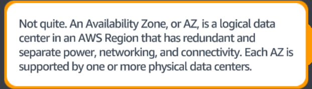

Actualmente, la infraestructura de AWS está distribuida por el mundo en 32 regiones y 102 zonas de disponibilidad (AZ). Una región de AWS es un área geográfica que contiene varias AZ (al menos 3). Las AZ son ubicaciones aisladas que tienen uno o más centros de datos (hasta 8). Los centros de datos son edificios que tienen entre 50000 y 80000 servidores físicos.

Las regiones están completamente aisladas y separadas entre sí, y en cada AZ hay uno o más centros de datos en instalaciones independientes, y con líneas eléctricas y conexiones de red redundantes. Además, las AZ son zonas de error independiente. Todo esto se hace para aumentar la tolerancia a cualquier fallo. 

Además, el cliente puede seleccionar la región geográfica en la que más le conviene aumentar el rendimiento disminuyendo la latencia de red.

### Evolución

#### Historia

1960s: Se inicia el desarrollo de Internet como una red de comunicación entre organismos del gobierno de Estados Unidos.
1970s: Se introduce el concepto de máquina virtual, que permite crear entornos aislados y configurables dentro de un mismo servidor.
1990s: Se populariza el uso de Internet como una plataforma para ofrecer servicios y aplicaciones a los usuarios finales.
2000s: Se consolidan los proveedores de servicios de nube, como Amazon, Google y Microsoft, que ofrecen infraestructura, plataformas y software como servicio a través de Internet.
2010s: Se desarrollan tecnologías de contenedores y orquestación, como Docker y Kubernetes, que permiten empaquetar, desplegar y gestionar aplicaciones de forma más ágil y eficiente en la nube.
2015: Se funda la Cloud Native Computing Foundation (CNCF), una organización que promueve el desarrollo y la adopción de tecnologías de cómputo en la nube nativas, como Kubernetes, Prometheus, Istio y muchos más.
2016-2020: Se lanzan servicios de cómputo sin servidores, como AWS Lambda, Azure Functions y Google Cloud Run, que permiten ejecutar código sin necesidad de administrar ni aprovisionar servidores. También se lanzan servicios híbridos y multicloud, como AWS Outposts y Azure Arc, que permiten extender y administrar los recursos de nube desde cualquier lugar.

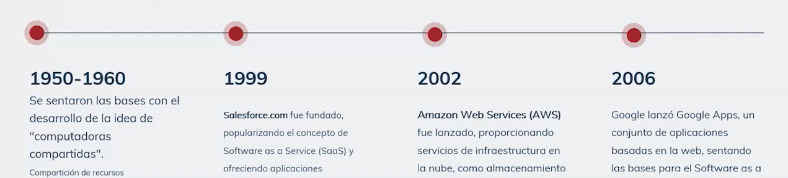

**1960**

- La idea de computadoras compartidas surge en torno a 1960.
- Las computadoras compartidas en sus comienzos eran máquinas muy grandes y costosas llamadas mainframes o centrales que podían ejecutar varias tareas al mismo tiempo, pero con una velocidad y capacidad muy limitadas.
- Las computadoras comparatidas no se desarrollaron mucho hasta los años 90.
- During 1961, John MacCharty delivered his speech at MIT that “Computing Can be sold as a Utility, like Water and Electricity.”
  
**1999**

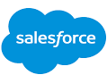
- Salesforce fue fundada en 1999.
- Salesforce demostró que se puede ofrecer un servicio de calidad a  través de Internet, siendo una de las primeras en ofrecer un servicio del modelo SaaS.
- Salesforce se encarga del CRM (Client Relation Management) de otras empresas. El CRM mejora los procesos de ventas, marketing, sevicio al cliente, gestión de proyectos, análisis de datos y otros aspectos del negocio.
- Salesforce ofrece soluciones para el sector financiero, sanitario, educativo, manufacturero, etc. 
- Algunas soluciones importantes: Sales Cloud, Marketing Cloud, Platform, MuleSoft, Tableau. Por ejemplo, Sales Cloud gestiona el ciclo de ventas (_sales cycle_ en inglés), desde la captación de clientes potenciales hasta el cierre de acuerdos.
- Algunas empresitas que son clientes de Salesforce: Spotify, Amazon, Adidas, Coca-Cola.

**2002**

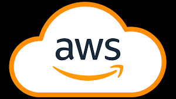
- AWS fue fundada en 2002.
- AWS es una empresa filial de Amazon (la empresa matriz o holding que gestiona AWS).
- AWS es una plataforma de servicios de computación en la nube.
- Salesforce migró su infraestructura a la nube de AWS en 2003, y fue una de las primeras. Desde entonces, AWS y Salesforce tienen una alianza estratégica mediante la cual ofrecen soluciones conjuntas a sus clientes.
- AWS lanzó sus primeros productos en la nube en 2006 (productos como S3 o EC2).
  
**2006**

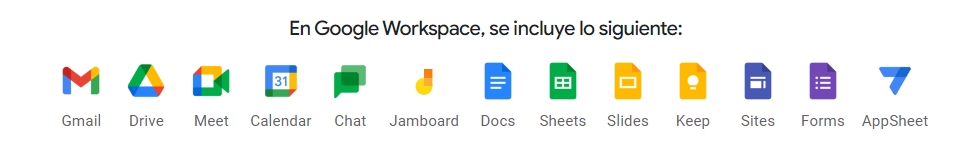
- Google Apps se lanzó en 2006.
- Google Apps es un conjunto de aplicaciones de productividad y colaboración en la nube ofrecido por Google. 
- Google Apps se lanzó como una versión para empresas de los servicios que ya ofrecía gratis: Gmail, Google Calendar, Google Docs.
- Google Apps fue añadiendo nuevas apps: Google Drive, Google Meet, Google Sites.
- Entonces, Google Apps ofrece SaaS. Pero también permite a los desarrolladores crear y ejecutar sus propias aplicaciones usando API.Por eso Google Apps también ofrece PaaS. Lo que no ofrece es IaaS. Google crea Google Coud Platform para ofrecer IaaS, y todo lo demás.
- Google Apps cambió su nombre a Google Workspace en 2020.

  
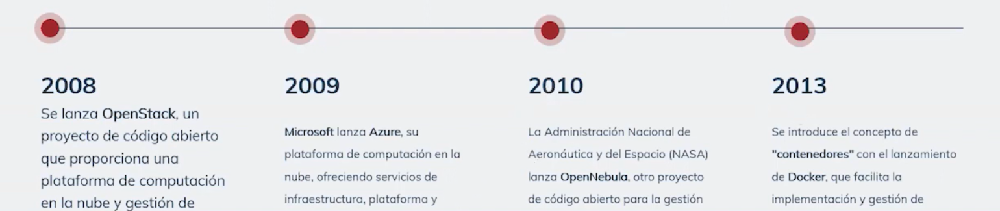

**2008**

- OpenNebula lanza su primera versión en 2008.
- OpenNebula fue creada en 2005 como un proyecto de investigación de la Universidad Complutense de Madrid.
- OpenNebula es una plataforma de computación en la nube de código abierto.

**2009**

- Microsoft lanza Azure en 2009.
- Azure es una plataforma de computación en la nube que ofrece los tres modelos de servicios.

**2010**

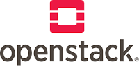
- OpenStack fue creada en 2010 por Rackspace y la NASA.
- OpenStack es una plataforma de cómputo en la nube de código abierto, al igual que OpenNebula.
- Tanto OpenStack como OpenNebula te permiten construir y gestionar infraestructuras de nube privada, pública e híbrida.
- OpenStack vs. OpenNebula:
  - Arquitectura: OpenStack tiene varios subsistemas gestionados por 14 subproyectos distintos, mientras que OpenNebula ofrece una plataforma integrada.
  - Modelo de gobernancia: OpenStack está impulsado por las necesidades de las empresas que participaron en su desarrollo, mientras que OpenNebula está impulsado por las necesidades de los usuarios finales.
  - Experiencia de usuario: OpenStack requiere una gran cantidad de tiempo y recursos para instalar, configuarar y mantener la plataforma, mientras que OpenNebula ofrece una solución que se puede instalar en minutos y es fácil de usar.
  - Compatibilidad: OpenStack tiene una mayor compatibilidad con otros proovedores de nube pública, como AWS.
  - Comunidad: OpenStack tiene comunidad más grande.
  - Variedad: OpenStack ofrece más opciones y funcionalidades para construir y gestionar la nube.

**2013**

- Los contenedores se popularizan gracias al lanzamiento de Docker.
- Los contenedores son entornos que empaquetan el código y todas sus dependencias para que puedan ejecutarse de forma aislada y consistente. Los contenedores les resolvieron la vida a los desarrolladores que tenían el famoso problema «en mi máquina sí funcionaba».
- Antes de los contenedores, el cómputo en la nube se basaba en VM (máquinas virtuales). Las VM ofrecían seguridad y aislamiento, pero por contra eran complejas, rígidas y consumían muchos recursos.
- Los contenedores han permitido una mayor agilidad y flexibilidad en el desarrollo de aplicaciones en la nube.
- AWS comenzó a ofrecer servicios de contendores desde 2014, cuando lanzó Amazon ECS (Elastic Container Service).

  
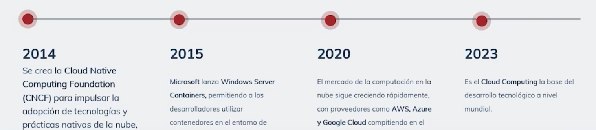

**2014**

- La CNCF se crea en 2014 (Cloud Native Computing Foundation).
- Antes de la CNCF, el cómputo en la nube era más heterogéneo y fragmentado. Había distintos proveedores, plataformas y estándares, y eso dificultaba la interoperabilidad de las aplicaciones.
- La CNCF promovió una mayor colaboración y armonía entre los diferentes actores del cómputo en la nube.

**2015**

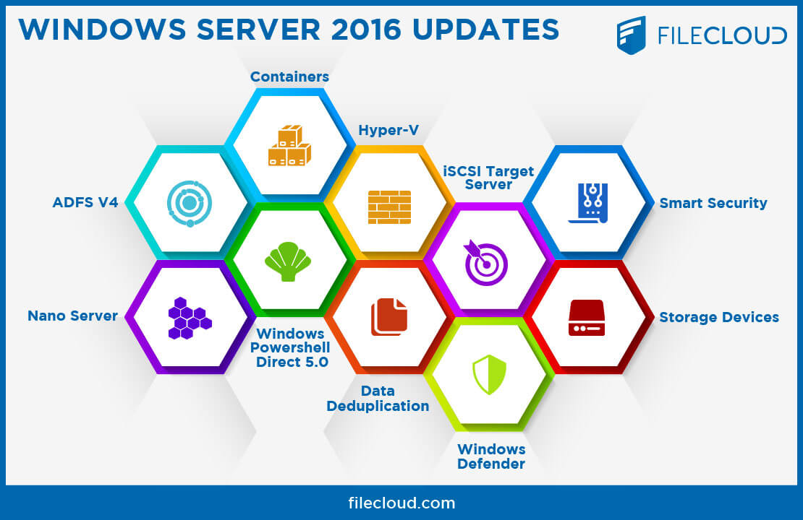
- Microsoft lanza Windows Server Containers
- Windows Server Containers se integra en el sistema operativo Windows Server 2016, como lo cuentan [en este artículo](https://learn.microsoft.com/en-us/archive/msdn-magazine/2017/april/containers-bringing-docker-to-windows-developers-with-windows-server-containers). 
- Taylor Brown es la cabeza detrás de proyectos como este, relacionados con la virtualización en Windows.

#### El futuro

Gartner es una consultora internacional especializada en tecnología.

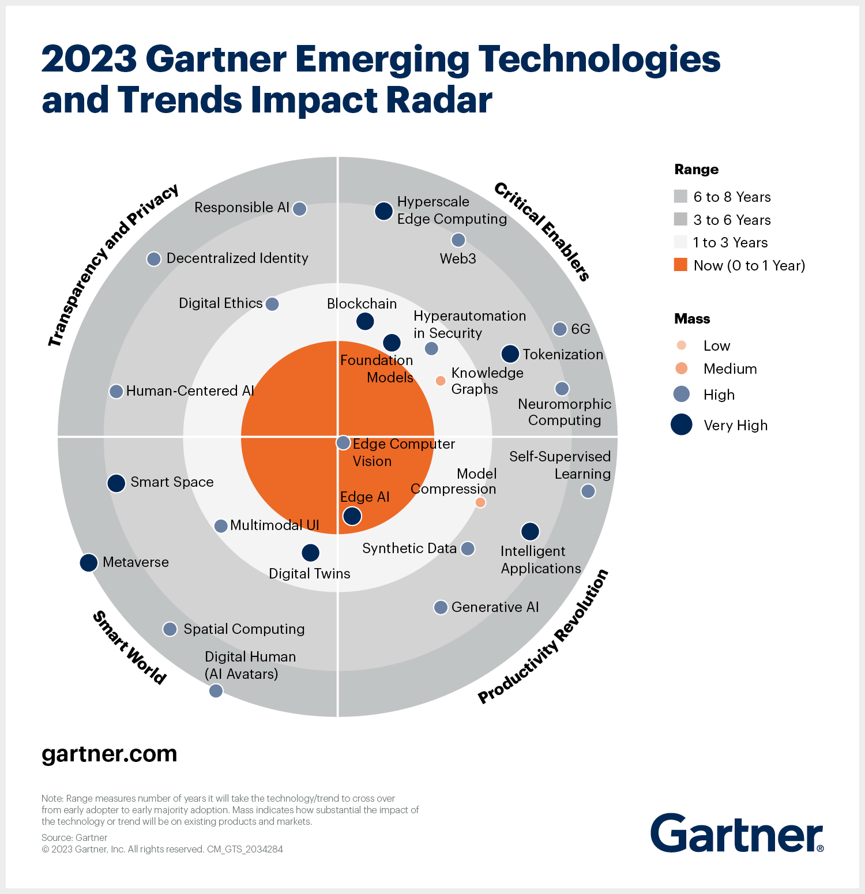

| Critical enablers (9) | Productivity revolution (7) | Smart world (6) | Transparency and privacy (4) |
|:---|:---|:---|:---|
| **Blockchain**   **Foundation Models**   Hyperautomation in Security   Knowledge graphs   **Hyperscale Edge Computing**   Web3   **Tokenization**   Neuromorphic Computing   6G | Edge Computer Vision   **Edge AI**   Model Compression   Synthetic Data   **Intelligent Applications**   Generative AI   Self-Supervised Learning       | **Digital Twins**   Multimodal UI   **Smart Space**   Spatial Computing   Digital Human   **Metaverse**         | Human-Centered AI   Digital Ethics   Decentralizaed Identity   Responsible AI             |

**Las 4 tendencias**

- Critical enablers

- Productivity Revolution

- Smart World

- Transparency and Privacy

**Las 9 tecnologías más importantes**

Blockchain
Foundational Models
Tokenization
Hyperscale Edge Computing

Edge AI
Intelligent Applications

Digital Twins
Smart Space
Metaverse

## Semana 1. A lo concreto

### ¿Qué se necesita  para tener un Data Center?

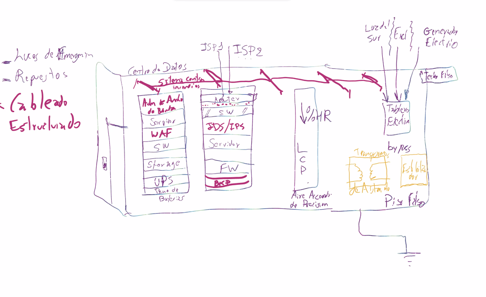

Mucho dinero. ¿Por qué?

- Sistema contraincendios
- Administrador de ancho de banda
- Servidor
- WAF
- SW
- Storage
- UPS
- ISP
- IDS/IPS
- FW
- BKP
- LCP
- Aire acondicionado de precición
- Transformador de aislamiento
- Estabilizador
- Piso falso
- Techo falso
- Generador eléctrico
- Luces de emergencia
- Repuestos
- Cableado estructurado

### Capex vs Opex

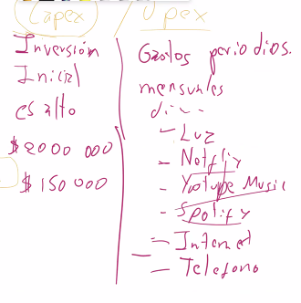

## Videos

Intro to AWS - The Most Important Services To Learn

https://www.youtube.com/watch?v=FDEpdNdFglI

## Semana 2. Clase 1

En cuanto a la facturación en la nube, no se habla de cotizaciones, sino de estimaciones.

Aprende subneting. En la nube se ven redes muy elaboradas.

El Anti-DDOS separa las conexiones legítimas de las maliciosas. métodos de identificación antbots.